  <!-- CUSTOM ANIMATED NEURAL HEADER (self-hosted — assets/header.svg) -->
  

    

  <!-- TYPING TELEMETRY -->
  

    

  <!-- COMMS -->
  

    
    
    
  

  

  

### 🛰️ `sys.core_directives`

I am an AI/ML Engineer with a deep mathematical foundation, architecting **0→1 AI systems with deterministic, verifiable output**. I do not build API wrappers — I fine-tune open-weights models, orchestrate stateful multi-agent systems, and engineer the backend infrastructure that keeps them alive in production.

- 🔭 **Current Deployment:** Founding Engineer @ **Importex**
- 🧠 **Architectural Focus:** Autonomous Multi-Agent Swarms · Open-Weights Fine-Tuning (QLoRA) · Heavy RAG · Hybrid Quantum CNNs
- 🏆 **Global Recognition:** NASA Space Apps Challenge Winner (Best Use of Science)
- 🎓 **Academic Base:** B.Tech CSE (Data Analytics), VIT-AP University

  

### ⏱️ `sys.operational_history`

| Designation | Organization | Sector / Tech Stack |
| :--- | :--- | :--- |
| **Founding Engineer** | Importex | `0→1 Engineering` `Scalable Backends` `Generative AI` |
| **AI / Data Engineer Intern** | Tritone Analytics (US) | `LangGraph` `FastAPI` `ChromaDB` `ETL — 100K+ records, −85% manual effort` |
| **AI / Data Science Intern** | Sabudh Foundation | `TensorFlow` `Deep Learning` `Telemetry Analysis` |

  

### 🧠 `sys.weaponized_stack`

  

    

| **AI / ML & Agentic Swarms** | **Data Engineering & Vector DBs** | **Backend & DevOps** |
|:---:|:---:|:---:|
|  |  |  |
|  |  |  |
|  |  |  |
|  |  |  |

  *Core Languages:* `Python` `Java` `C/C++` `SQL`  ·  *Math Base:* `Probability & Statistics` `Linear Algebra` `Computational Logic`

  

### 🚀 `sys.neural_architecture` — Mission Logs

<b>🛰️ SeismoSearch + Martian-Llama-3.1-8B</b> — <i>NASA Space Apps Global Winner (Best Use of Science)</i>

 

> Algorithmic STA/LTA signal-processing pipeline (ObsPy) isolating seismic anomalies from raw planetary waveform data, paired with a **Llama-3.1-8B fine-tuned via 4-bit QLoRA (rank 16)** to classify telemetry across 5 frequency profiles.
>
> `Python` `Unsloth` `QLoRA` `ObsPy` → **[Repo](https://github.com/keshav301104/SeismoSearch)**

<b>🧠 Cerebrospatial Quantum Platform (CSQP)</b> — <i>Quantum ML × Neurosurgery</i>

 

> Real-time CV pipeline tracking intraoperative brain-tissue shift in px/mm, fused with a **hybrid Quantum CNN (PennyLane)** and a LangGraph supervisor issuing deterministic safety alerts at sub-second latency.
>
> `PyTorch` `PennyLane` `OpenCV` `LangGraph` → **[Repo](https://github.com/keshav301104/CSQP)**

<b>🔍 Veritas Engine</b> — <i>Dual-Mode Claims Audit Swarm</i>

 

> Dual-mode 4-node LangGraph swarm auditing multi-modal document claims for VCs and researchers. Claims execute inside an **isolated Python sandbox**; a compression node cuts token payload by ~90%.
>
> `LangGraph` `Llama-3.3-70B` `FastAPI` `Next.js` → **[Repo](https://github.com/keshav301104/Veritas-Engine)**

<b>⚙️ WebForge AI (Troopod)</b> — <i>Autonomous Agentic CRO Engine</i>

 

> Multimodal LangGraph agents with Deep DOM Tracking that rewrite live landing pages autonomously for conversion-rate optimization.
>
> `LangGraph` `BeautifulSoup4` `Next.js` → **[Repo](https://github.com/keshav301104/WebFordge-AI)**

  

### 📡 `sys.live_telemetry`

  
  

    

  

    

  

    

  

    

  <!-- CONTRIBUTION SNAKE (generated by .github/workflows/snake.yml) -->
  

---

  

